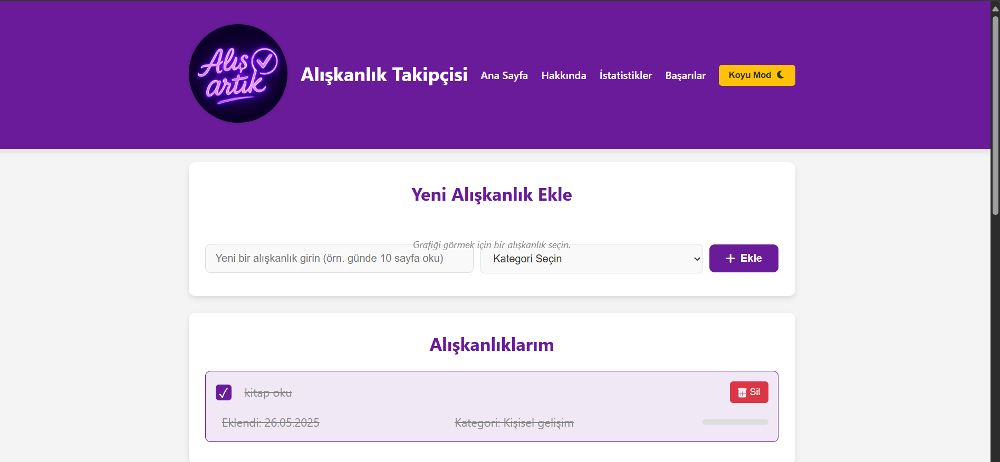
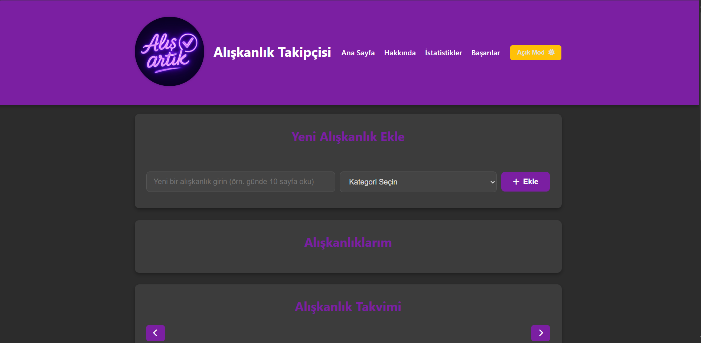
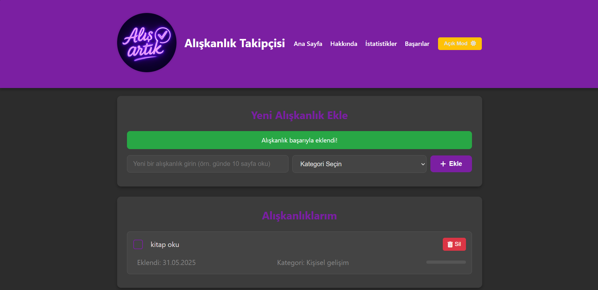
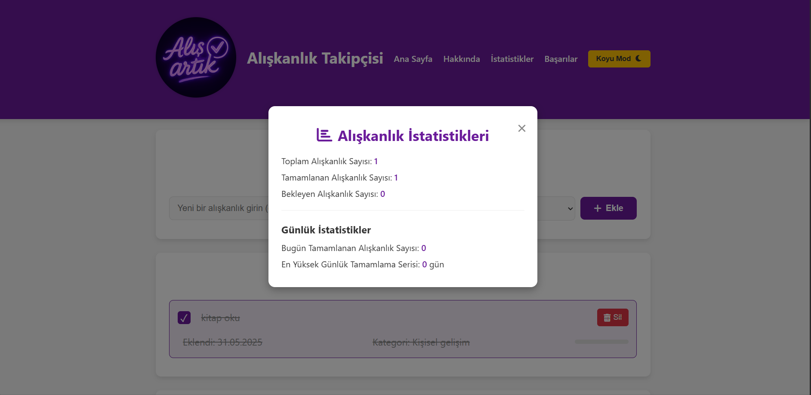
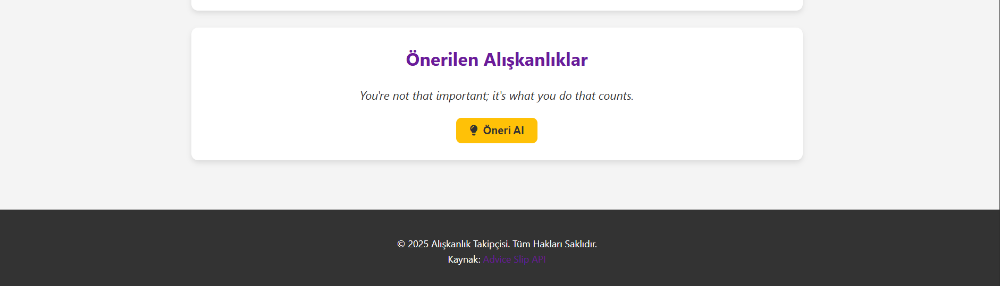
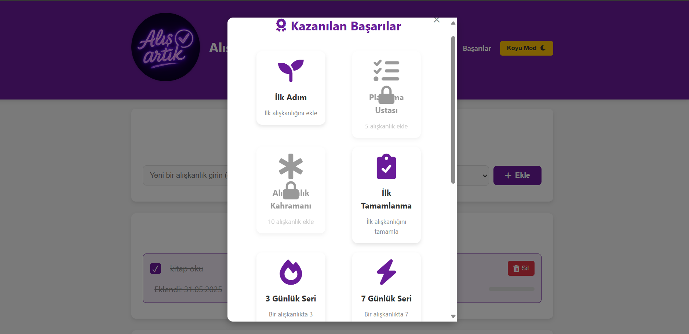
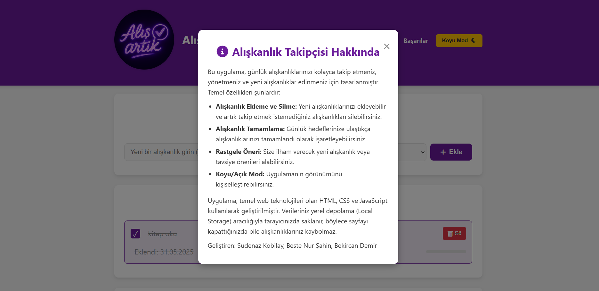

# Etkileşimli Alışkanlık Takibi

Bu proje, kullanıcıların günlük alışkanlıklarını kolayca takip etmeleri, yeni alışkanlıklar edinmeleri ve kişisel gelişimlerini desteklemeleri için tasarlanmış basit ve kullanıcı dostu bir web uygulamasıdır.

## Projenin Amacı Ve Özellikleri

Amacımız, sade bir arayüz ile alışkanlık takibini herkes için erişilebilir kılmaktır. Uygulama, temel web teknolojileri (HTML, CSS, JavaScript) kullanılarak geliştirilmiştir ve tarayıcı tabanlı çalışır.

## 🚀 Özellikler

- ✅ Yeni alışkanlık ekleme ve silme
- 📆 Alışkanlık takvimi ve günlük işaretleme
- 📊 Aylık ilerleme çubuğu grafiği
- 🎯 Başarı sistemi (örneğin: 5 gün üst üste tamamla → başarı kazan)
- 🌙 Açık/Koyu tema desteği
- 💡 Harici API ile rastgele motivasyonel öneriler
- 📈 İstatistikler: toplam, tamamlanan ve bekleyen alışkanlık sayısı
- 💾 Veriler localStorage üzerinde saklanır (sayfa yenilense bile veri kaybolmaz)

## 🖼️ Ekran Görüntüleri
Uygulamanın farklı görünümlerini aşağıda bulabilirsiniz:

### Ana Ekran (Açık Mod)


### Koyu Mod


### Alışkanlık Ekleme ve Başarı Mesajı


### İstatistikler Modalı


### Önerilen Alışkanlıklar


### Kazanılan Başarılar Modalı


### Hakkında Modalı


### Alışkanlık Takvimi Modalı


## 💻 Kullanılan Teknolojiler

- HTML5
- CSS3 (Flexbox, Responsive Design)
- JavaScript (ES6)
- localStorage

## 🌐 Kullanılan API: [Advice Slip API](https://api.adviceslip.com)

Kullanıcılara rastgele öneriler sunmak için [**Advice Slip API**](https://api.adviceslip.com) entegre edilmiştir.

### Ne işe yarar?
Bu API, her istek gönderildiğinde farklı bir **motivasyon cümlesi** döndürür. Bu da uygulamanın kullanıcıya ilham veren bir deneyim sunmasını sağlar.

### Nasıl kullanıldı?
```javascript
fetch("https://api.adviceslip.com/advice")
  .then(res => res.json())
  .then(data => {
    suggestionText.textContent = `"${data.slip.advice}"`;
  })
  .catch(error => {
    apiErrorMessage.textContent = "Öneri yüklenemedi. Lütfen tekrar deneyin.";
  });
```

## 📁 Dosya Yapısı

- index.html: Uygulamanın ana HTML yapısını tanımlar.
- style.css: Uygulamanın görsel stilini ve tema geçişlerini sağlar.
- script.js: Uygulamanın tüm dinamik işlevselliğini (alışkanlık ekleme/silme, tamamlama, istatistikler, tema geçişi, yerel depolama yönetimi) barındırır.

## ⚙️ Kurulum ve Kullanım

1. Bu projeyi GitHub’dan klonlayın veya ZIP olarak indirin.
2. `index.html` dosyasını bir tarayıcıda açın.
3. İnternet bağlantınız olduğunda öneri alma özelliği otomatik çalışacaktır.

 ## 🔍 Test Rehberi

- Farklı ekran boyutlarında (mobil/tablet/masaüstü) test edildi
- Chrome, Firefox, Safari gibi farklı tarayıcılarda düzgün çalışır
- localStorage sayesinde veri kaybı yaşanmaz


## ⚙️ Ana İşlevler ve Özellikler

### 🧩 Alışkanlık Yönetimi (`script.js`)
- `habits` dizisi, tüm alışkanlıkları ve durumlarını saklar.
- `addHabit()`: Yeni alışkanlık oluşturur, listeye ekler ve localStorage'a kaydeder.
- `renderHabitList()`: habits dizisine göre HTML listesini dinamik olarak oluşturur.
- `toggleDailyCompletion()`: Bir günün işaretlenip işaretlenmediğini değiştirir ve kaydeder.
- `deleteHabit()`: Seçilen alışkanlığı listeden ve localStorage'dan kaldırır.
- `saveHabits()`: Alışkanlık listesini JSON formatında localStorage’a kaydeder.

### 🎨 Tema Yönetimi (`script.js`, `style.css`)
- `localStorage` ile kullanıcının tercih ettiği tema (koyu/açık) saklanır.
- `loadTheme()`: Sayfa yüklendiğinde daha önce seçilen tema uygulanır.
- `toggleTheme()`: Tema değiştirilir ve localStorage güncellenir.
- CSS değişkenleri (`:root` ve `.dark-mode`) ile renk yönetimi yapılır.

### 📊 İstatistik Takibi (`script.js`)
- `updateStats()`: Toplam, tamamlanan ve bekleyen alışkanlık sayılarını günceller.
- `dailyCompletedCount`: Bugün tamamlanan alışkanlık sayısını takip eder.
- `longestStreak`: En uzun ardışık gün serisini hesaplar.
- `resetDailyCompletions()`: Gün değişiminde sayaçları sıfırlar.

### 📦 Modal Pencereleri (`script.js`, `style.css`)
- "Hakkında", "İstatistik" ve "Başarılar" modalları bilgi gösterimi için kullanılır.
- Modallar JavaScript ile açılıp kapatılır, CSS ile biçimlendirilir.

### 💡 Alışkanlık Önerileri (`script.js`)
- `fetchSuggestion()`: [Advice Slip API](https://api.adviceslip.com) kullanılarak rastgele öneri getirir.
- Gelen öneri `suggestionText` alanına yazılır.
- `catch()` bloğu ile hata durumunda kullanıcıya uyarı mesajı gösterilir.

### 📅 Takvim ve Grafik Gösterimi
- `renderCalendar()`: Seçilen alışkanlığa göre günleri takvimde gösterir.
- `renderMonthlyProgressChart()`: Günlük tamamlama verilerine göre çubuk grafik oluşturur.


## 👩‍💻 Katkıda Bulunanlar

- Sudenaz Kobilay
- Beste Nur Şahin
- Bekircan Demir

## 📄 Lisans

Bu proje [MIT Lisansı](https://opensource.org/licenses/MIT) ile lisanslanmıştır.